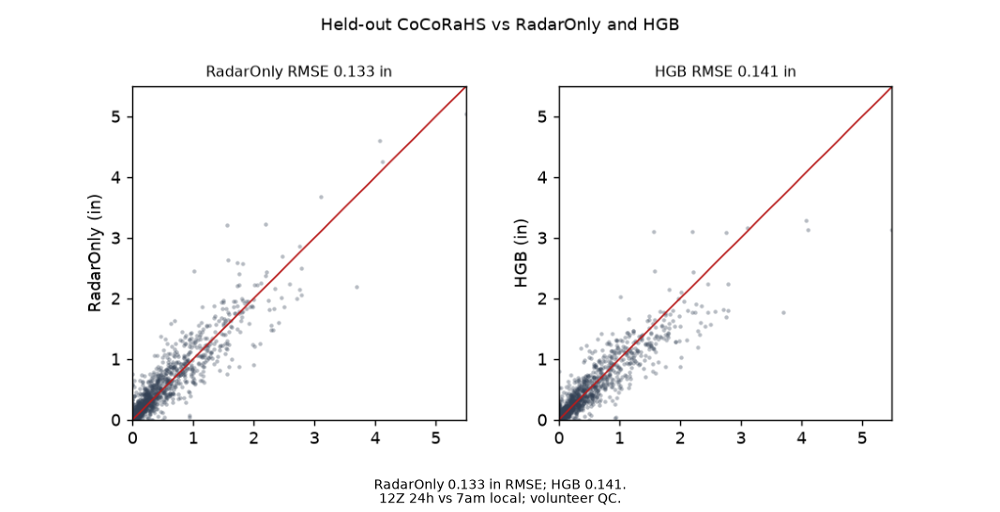
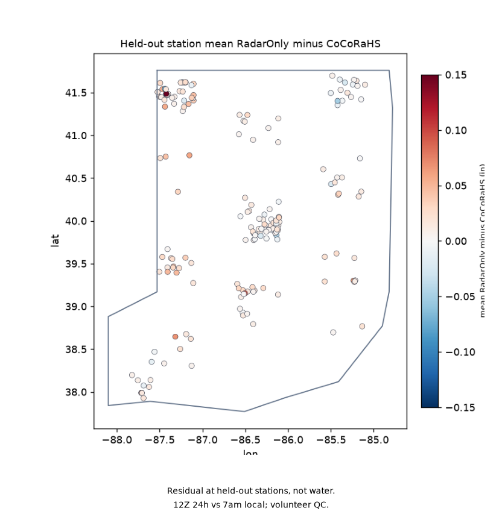

# Indiana CoCoRaHS vs RadarOnly MRMS

Does RadarOnly MRMS match CoCoRaHS daily rain at held-out Indiana stations?

MRMS RadarOnly is close; a tree does not beat it on amount. Held-out RMSE is 0.133 in (CSI 0.82). HGB is 0.141 at stations it never trained on. IDW of other CoCoRaHS is 0.209. Ridge is 0.124 RMSE then 0.049 MAE against radar's 0.048: that 0.009 in is noise, not a method. Fixture HGB beating identity does not rescue live skill.

Science lock `ac36f0f`. 685 eligible Indiana stations, 409 train-block, 177 held-out. Train n=30717 through 2024-09-30. Holdout n=19189 from 2024-10-01. RadarOnly 24H at 12Z. GaugeCorr stays out. This tree does not read `p_sfha`. Rain-stage stays frozen.

Sibling rain-to-stage (Stage IV, Nora; different question): https://github.com/martialsystems/white_river_rain_stage



Figure 1. Live holdout at 177 stations: CoCoRaHS vs RadarOnly and vs HGB. RadarOnly RMSE 0.133 in; HGB 0.141. 12Z 24h vs 7am local; volunteer QC.



Figure 2. Mean RadarOnly minus CoCoRaHS at held-out stations. Residual, not water. 12Z 24h vs 7am local; volunteer QC.

## Live skill (held-out stations)

Locked from `logs/in_live/stage_c_report.json` at `ac36f0f`. Inches. Summers 2024 train, 2025 and 2026 holdout. Identity is raw RadarOnly. IDW uses same-day train-block CoCoRaHS. HGB is the ML.

| Model | RMSE (in) | MAE (in) | Bias (in) | CSI 0.10 in |
|-------|----------:|---------:|----------:|------------:|
| RadarOnly | 0.133 | 0.048 | +0.013 | 0.82 |
| IDW | 0.209 | 0.076 | +0.001 | 0.72 |
| Ridge | 0.124 | 0.049 | +0.001 | 0.83 |
| HGB | 0.141 | 0.048 | -0.004 | 0.84 |

Do not chase 0.009 in of RMSE.

## Why RadarOnly

CoCoRaHS daily reports are the labels. MRMS GaugeCorr and MultiSensor Pass2 ingest gauges. Scoring those products at CoCoRaHS sites is leakage. RadarOnly is independent of the labels.

## Split

0.5° blocks. Every fourth block is holdout. Train stations never test. Dates: train through 2024-09-30, holdout from 2024-10-01. August 2026 is not in train.

## Day match

CoCoRaHS date D versus RadarOnly 24H ending 12Z on D (7am EST). EDT is a 1-hour mismatch. Central-time Indiana counties are a further mismatch. Volunteer QC stays in the caption.

## Stage 0

Synthetic stations and a planted east-multiplicative radar bias so CI trains without NOAA. Fixture HGB RMSE 0.039 vs RadarOnly 0.089 on 1716 holdout rows. That shows the pipeline can recover a planted bias. It is not live skill.

```bash
python3.12 -m venv .venv
source .venv/bin/activate
pip install -r requirements.txt
PYTHONPATH=src:. python3 scripts/run_fixture.py logs/stage0_fixture
.venv/bin/python -m pytest tests -q
PYTHONPATH=src:. python3 scripts/run_live.py logs/in_live data/raw/mrms
```

Do not use stock `/usr/bin/python3 -m pytest`: it has no rasterio. HTTP 404 or an empty CoCoRaHS export stops (`run_live.py` exit 2). PRISM, Daymet, and Stage IV are not substitutes. Two figures max, then this tree can stop.

| File | Role |
|------|------|
| [METHODOLOGY.md](METHODOLOGY.md) | Locked contract |
| [AGENTS.md](AGENTS.md) | Agent rules |
| [CHECKLIST.md](CHECKLIST.md) | Operator list |
| `src/inrain/` | CoCoRaHS, RadarOnly clip, spatial split, identity/IDW/Ridge/HGB, figures, claims |
| `qpeforge/` | GraphForge pin: no `p_sfha`, spatial holdout, RadarOnly fetch-or-stop, claim bans |
